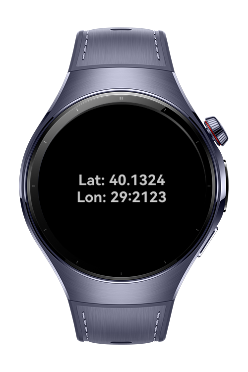

> **Note:** To access all shared projects, get information about environment setup, and view other guides, please visit [Explore-In-HMOS-Wearable Index](https://github.com/Explore-In-HMOS-Wearable/hmos-index).

# How To Show User Location

This app is a lightweight HarmonyOS application that retrieves the user's current location (latitude and longitude) using LocationKit and displays it cleanly on screen. It’s built with simplicity and speed in mind, making it ideal for demos, POCs, or feature baselining.

# Preview




# Use Cases

-  Real-time location fetching via `geoLocationManager`
-  Displays latitude and longitude in human-readable format
-  Optimized for **fast retrieval** using speed-priority location mode


# Technology

## Stack
- **Languages**: ArkTS, ArkUI
- **Frameworks**: HarmonyOS SDK 5.1.0(18)
- **Tools**: DevEco Studio Vers 5.1.1.823
- **Libraries**:
    - @kit.NotificationKit
    - @kit.BackgroundTasksKit

## Required Permissions

- `ohos.permission.APPROXIMATELY_LOCATION`
- `ohos.permission.LOCATION`
- `ohos.permission.INTERNET`


# Directory Structure

```
entry/src/main/ets/
│    pages/
│     └── Index.ets
└──  utils
      ├── Constants.ets
      └── LocationUtil.ets   
```

# Constraints and Restrictions

## Supported Device
- Huawei Watch 5


# License

CalmTune is distributed under the terms of the MIT License.

See the [LICENSE](/LICENSE) for more information.


